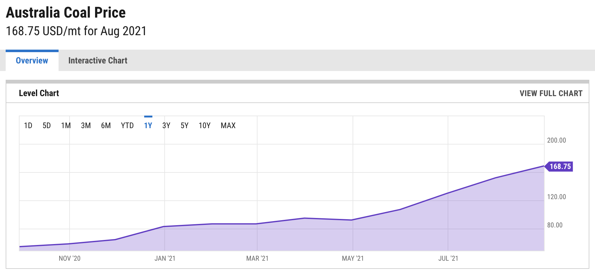

# 拉闸限电严重波及民生 东北电力紧缺

> 今年煤炭价格涨幅超过100%，发电站成本与日俱增，东北开启限电模式，且无任何通知，寒冬将至，这个冬天将注定不会平凡。

澳洲[煤炭](https://ycharts.com/indicators/australia_coal_price)价格一路高涨

---
> 以下为新闻[原文](http://www.chinanews.com/cj/2021/09-27/9574872.shtml)

中新网客户端北京9月27日电 (记者 谢艺观)“大清早停水停电，家里一滴水没有，马桶都冲不了”“手机没有信号，完全上不了网”“家里没电做不了饭，下楼发现，都是找饭的人”……

　　最近不少东北地区网友反映家里停电，“东北限电”的消息也登上微博热搜，引发广泛关注。东北地区之外，其他地方亦传出“限电”消息，发生了什么？为何电突然不够用了？

--- 

为何停电呢：

26日，吉林省委常委、常务副省长吴靖平在全省保电煤供应保温暖过冬保工业运行视频调度会议上表示，受全国性煤炭紧缺、煤价高企、煤电价格倒挂影响，目前绝大多数省份出现供电紧张局面。

